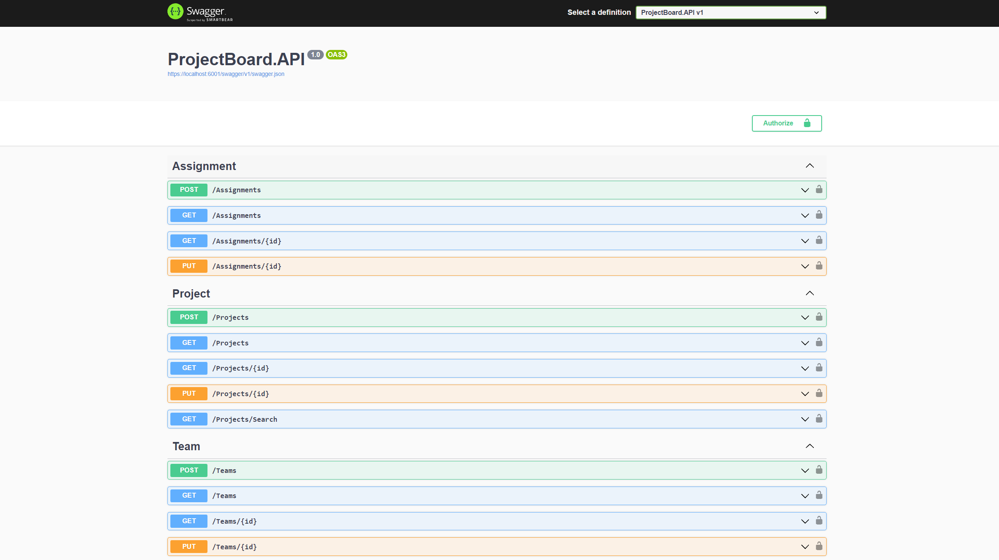
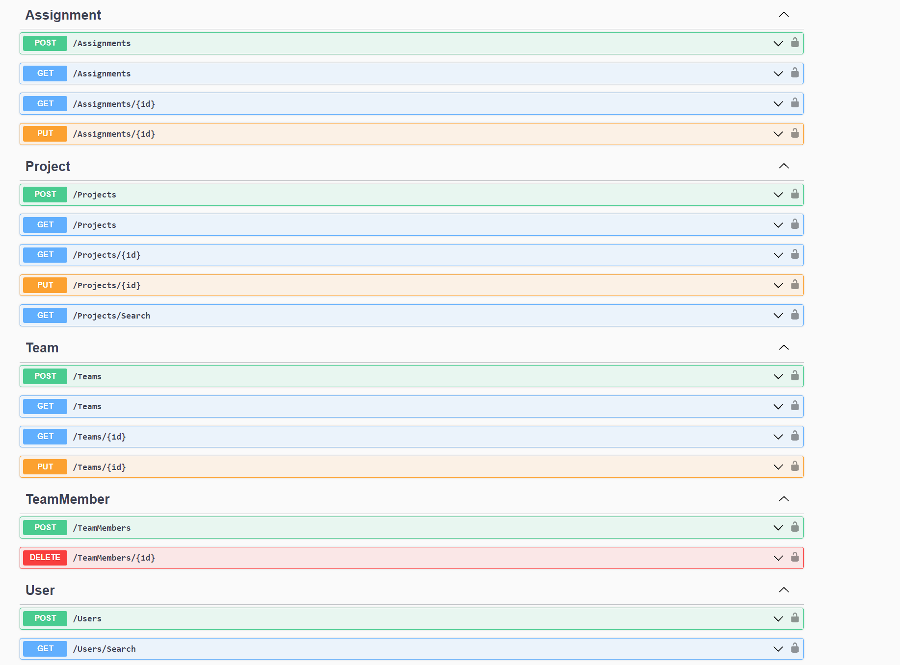

# Main Description
This application represents minimal API, developed for testing and training purposes only.
End result is based on a team-development and processing.
Following technologies included:
- Minimal Api 
- Automapper
- Repository pattern
- MediatR
- DynamoDb & AWS for structuring the data.
- Pagination where collections of multiple items might be requested from database, resulting in less data costs imposed.
- Following SOLID principles and OOP
- OpenAPI Authentication/Authorization and Cognito user's pool.
- xUnit for testing the application - especially testing MediatR handlers.
- Fluent Validator - for validating the user inputs.
- xUnit testing validation logic.
- Used Validation Behaviour pipeline implementation, so that any input error occurrence will be handled before getting into the MediatR handlers.

# Gallery 

